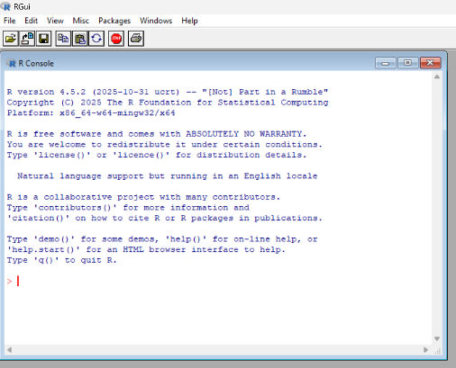

## Why R

R is a programming language, but more than that, it is an interactive environment [@rfoundationwhat]. A typical R script is run line by line rather than compiled all at once. The [objects](06_objects.qmd) you create live in memory, allowing you to query, run, and tweak code continuously.

R is designed by statisticians, for statisticians. It is very flexible, and because it is free and open source (we will define these concepts in Part 2 of the bootcamp) maintained by the R Core Team [@rfoundationcontributors], it is very popular -- especially in biostatistics and epidemiology. Contributors from around the world develop and maintain packages for others to use.

Data scientists often use a mix of programming languages. Each has its strengths. For example, R tends to be better for data processing and visualization, whereas Python tends to be better for machine learning.

But why write code at all? Well, think of how you would perform data analysis on Microsoft Excel. The raw dataset you receive may contain typos, missingness, duplicates, and formatting errors. You may have to manually edit some cells. You may also receive multiple datasets to merge, rows to filter, and columns to create or remove or transform.

1. How vulnerable is the workflow to human error?
2. How much time is spent on manual data cleaning?
3. Are there some functions you wish could be customized?
4. Are there any features in your Excel version that others with different versions might not be able to run?
5. Where are all these steps documented? What if a peer reviewer wants you to change the data cleaning rule? What if someone else wants to reproduce your workflow?

In this section of the bootcamp, we will see how R addresses points 1-3. In the next section, we will explore dependency management and version control, which address points 4-5.

## R app

If you open the basic R app, you will see the R console.

It is not pretty! Although it has some core functionalities, there are a number of quality of life improvements when using RStudio, which we will explore next.

::: {.content-visible when-format="html"}
## References
:::
