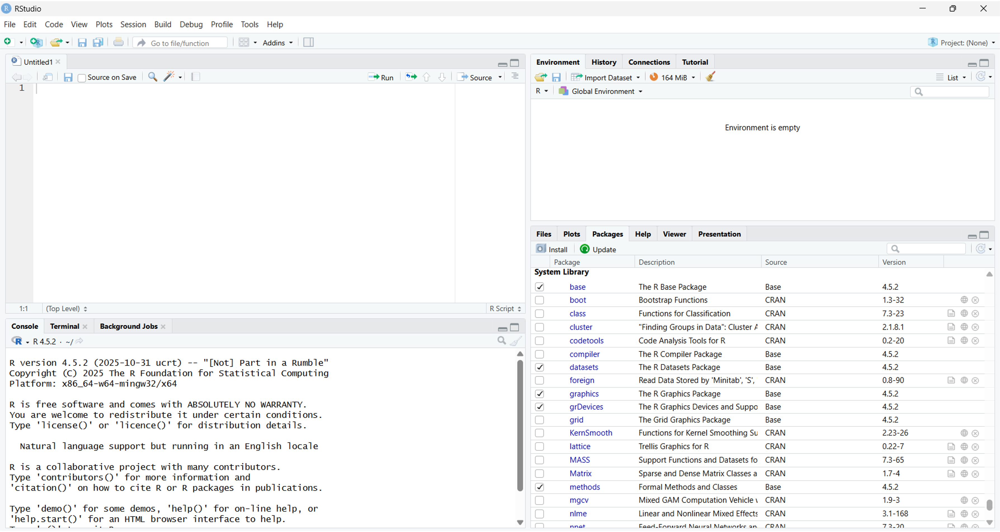
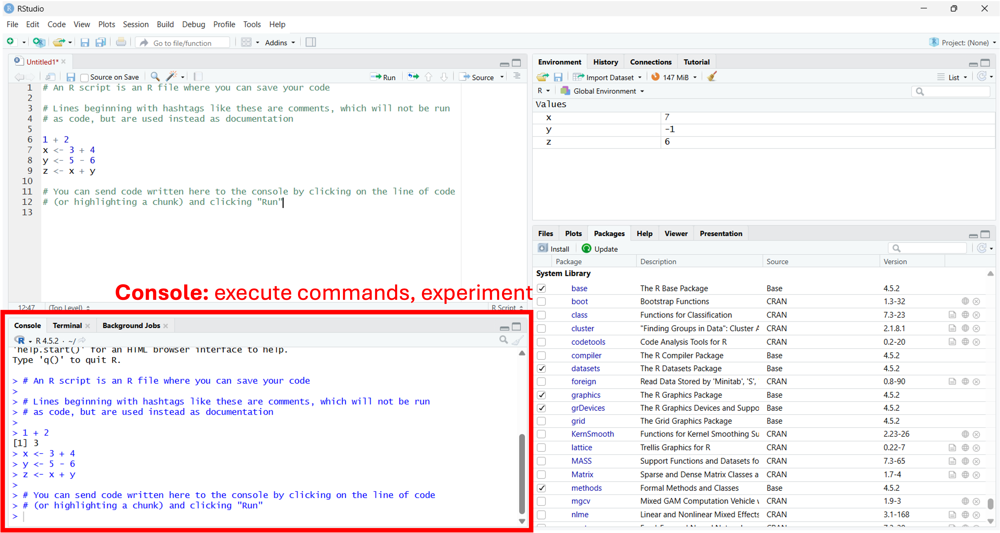
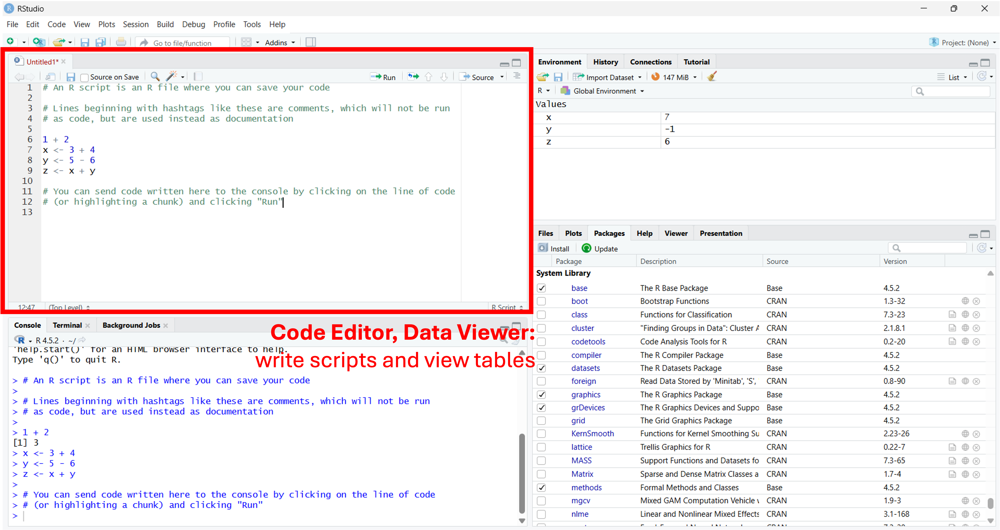
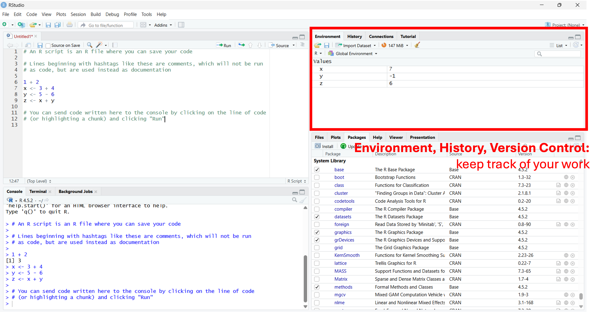
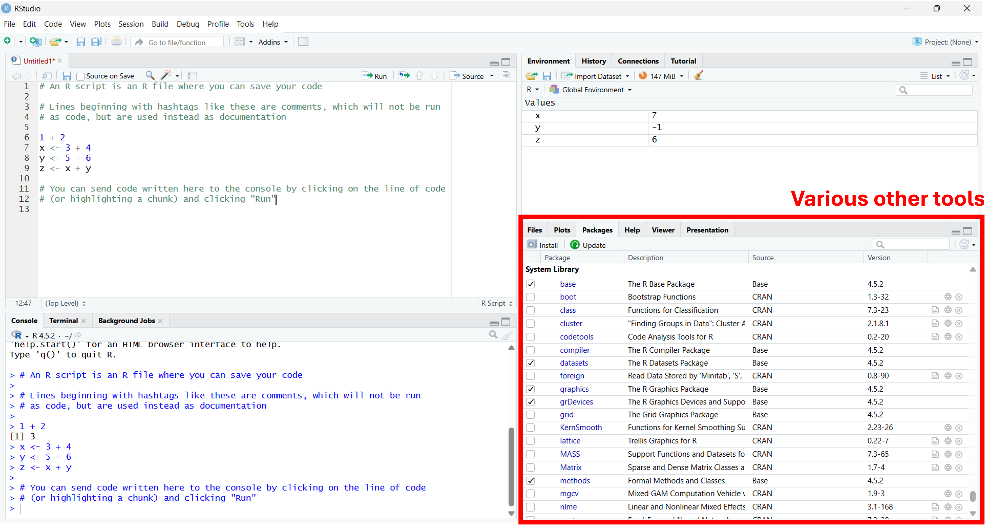
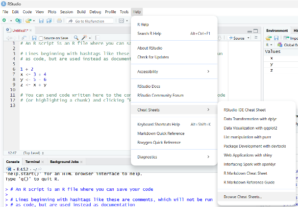
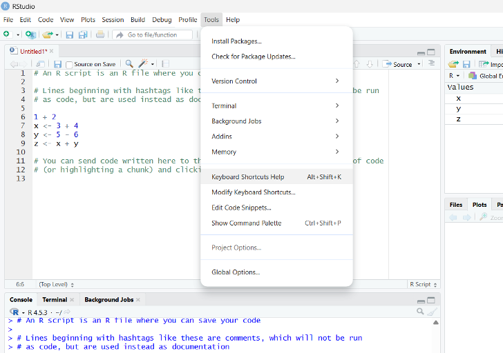
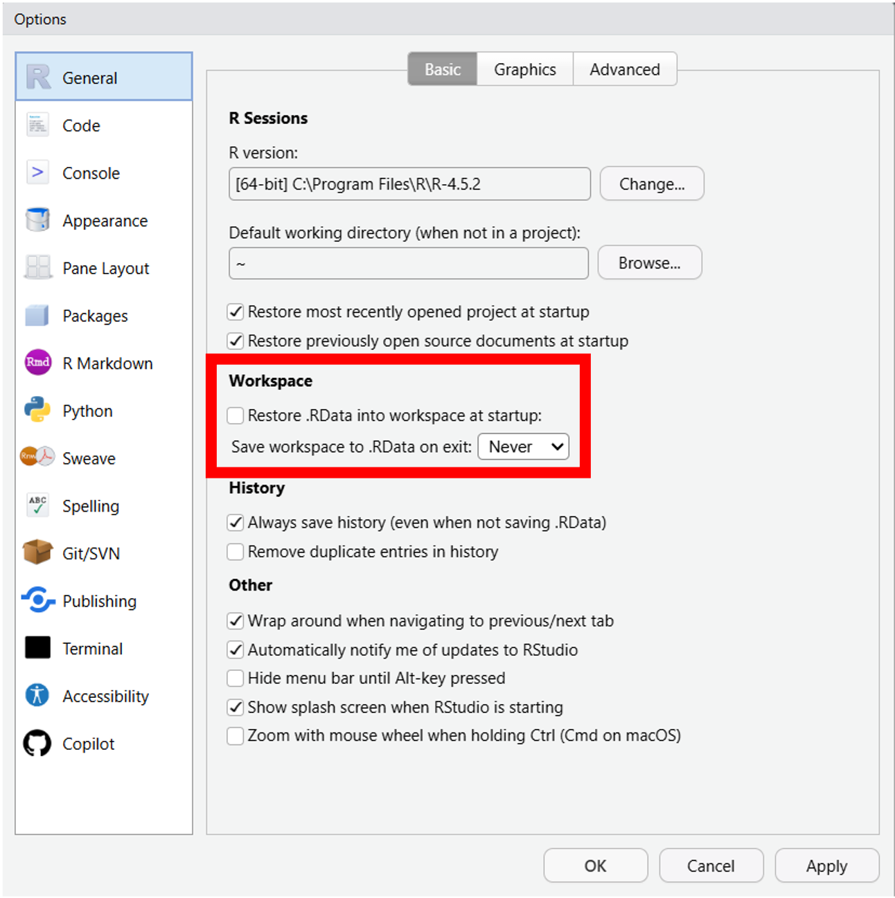

## Why RStudio

RStudio is an integrated development environment (IDE) for R. It offers a convenient interface for tools; you can think of RStudio for R what Microsoft Word is for English. It is free and open source, maintained by Posit [@positrstudio]. It is widely popular and most R users use it through RStudio.

Compared to the basic R app, RStudio offers many more functionalities, including:

+----------------------------------------+----------------------------------+----------------------------------+
| Feature                                | R app                            | RStudio                          |
+========================================+==================================+==================================+
| [Panes (below)](02_rstudio.qmd#panes)  | - Console\                       | - Console\                       |
|                                        | - Editor (separate window)\      | - Editor\                        |
|                                        | - Plots/help (separate window)   | - Plots/help\                    |
|                                        |                                  | - Environment                    |
+----------------------------------------+----------------------------------+----------------------------------+
| Syntax highlighting                    | ~                                | $\checkmark$                     |
+----------------------------------------+----------------------------------+----------------------------------+
| Code completion                        | ~                                | $\checkmark$                     |
+----------------------------------------+----------------------------------+----------------------------------+
| Debugger                               | ~                                | $\checkmark$                     |
+----------------------------------------+----------------------------------+----------------------------------+
| Package manager                        | ~                                | $\checkmark$                     |
+----------------------------------------+----------------------------------+----------------------------------+
| [R projects](04_rproj.qmd)             | $\times$                         | $\checkmark$                     |
+----------------------------------------+----------------------------------+----------------------------------+
| Git integration*                       | $\times$                         | $\checkmark$                     |
+----------------------------------------+----------------------------------+----------------------------------+
| R markdown support*                    | $\times$                         | $\checkmark$                     |
+----------------------------------------+----------------------------------+----------------------------------+
| Quarto support*                        | $\times$                         | $\checkmark$                     |
+----------------------------------------+----------------------------------+----------------------------------+

\* *We will discuss these more in Part 2 of the bootcamp. RStudio is not the only way to integrate with Git, write R markdown, or render using Quarto.*

## Panes

## Resources

{width=600px}

{width=600px}

Some common shortcuts:

+----------------------------------+------------------+----------------------+
| Shortcut                         | Windows          | macOS                |
+==================================+==================+======================+
| New R script                     | `Ctrl+Shift+N`   | `Command+Shift+N`    |
+----------------------------------+------------------+----------------------+
| Move cursor to Editor pane       | `Ctrl+1`         | `Control+1`          |
+----------------------------------+------------------+----------------------+
| Move cursor to Console pane      | `Ctrl+2`         | `Control+2`          |
+----------------------------------+------------------+----------------------+
| Run selected                     | `Ctrl+Enter`     | `Command+Enter`      |
+----------------------------------+------------------+----------------------+
| Run all                          | `Ctrl+Alt+R`     | `Option+Command+R`   |
+----------------------------------+------------------+----------------------+
| Run from beginning to line       | `Ctrl+Alt+B`     | `Option+Command+B`   |
+----------------------------------+------------------+----------------------+
| Comment/uncomment                | `Ctrl+Shift+C`   | `Command+Shift+C`    |
+----------------------------------+------------------+----------------------+
| Reflow comments within margins   | `Ctrl+Shift+/`   | `Control+Shift+/`    |
+----------------------------------+------------------+----------------------+

::: {.callout-tip}
## **Tip**
By default, RStudio preserves your workspace between sessions. This can encourage sloppy behaviour like relying on prior ad hoc work, rather than writing reproducible scripts.

1. Go to **Tools > Global Options...**
2. Click the **General** tab
3. Uncheck **Restore .Rdata into workspace at startup:**
4. Beside **Save workspace to .Rdata on exit:** select **Never**

{width=400px}
:::

::: {.callout-tip}
## **Tip**
To change RStudio to dark theme:

1. Go to **Tools > Global Options...**
2. Click the **Appearance** tab
3. Under **Editor theme:**, select a theme of your choice (I prefer Vibrant Ink for its strong syntax highlight contrast)
:::

::: {.content-visible when-format="html"}
## References
:::
