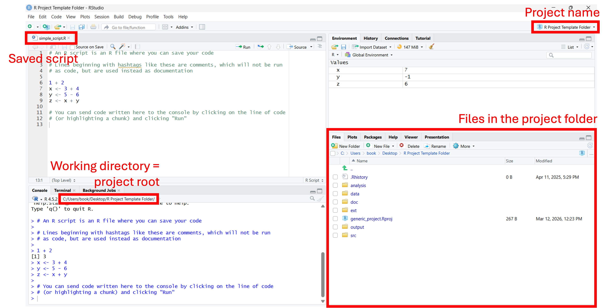

<div style="height: 2em;"></div>


## Repositories

A **repository** (aka "repo") is a place to store the files related to a project. On your computers, this would be a directory for a given project. Directories are hierarchical. For example, `folder/file.csv` means that within your working directory there is a `folder/`, and within that there is a `file.csv`. To make it explicit, we often use `./` to denote the working directory (e.g., `./folder/file.csv`) and `../` to denote the parent directory (i.e., one directory up; to go two directories up, use `../../`). For example, a repository may look like this:*

```text
.
├── analysis/
│   ├── 01_clean.R
│   ├── 02_visualize.R
│   └── 03_model.R
├── data/
│   ├── raw/
│   └── processed/
├── docs/
│   ├── assets/
│   │   ├── images/
│   │   └── videos/
│   ├── manuscript/
│   │   ├── manuscript.qmd
│   │   ├── american-medical-association.csl
│   │   └── references.bib
│   ├── protocol/
│   │   ├── manuscript.qmd
│   │   ├── american-medical-association.csl
│   │   └── references.bib
│   └── slides/
├── output/
│   ├── figures/
│   └── tables/
├── src/
│   ├── clean_dates.R
│   ├── import_data.R
│   ├── plot_time_series.R
│   └── model_arima.R
└── drugs_canada.RProj
```
\* *This is the way I like to set up repositories. Feel free to set it up differently -- whatever works best for you and your team!*

In contrast to relative paths (`./` and `../`), we may also use absolute paths like `C:\Users\your-name\Desktop\folder\file.csv` on Windows (which traditionally uses backslashes, but can handle forward slashes too) or `/Users/your-name/Desktop/folder/file.csv` on macOS. Notice that absolute paths are sensitive to the user's operating system, username, and wherever they decide to save the repostiroy, making them irreproducible for shared code on personal computers.

::: {.callout-tip}
## **Tip**
Use forward slashes to: (1) ensure compatibility across operating systems and (2) avoid confusion in R, where the backslash has a special meaning.
:::

We will revisit repository structures again in Part 2 of the bootcamp because there are some additional files for dependency management and code sharing that are not shown here. However, this is a good starting point.


## R projects

R projects (the `.Rproj` file you saw above) are one of the major advantages of using RStudio. Specifically, the benefits include:

- Identifies the project root (i.e., the directory containing the `.Rproj` file) as the working directory
    - If you open the `.Rproj` file, RStudio will automatically set the project root as the working directory.
    - Even if you do not open the `.Rproj` file, functions like `here::here()` can find the project root by searching for `.Rproj`.
    - This eliminates the need for setting the working directory yourself (`setwd()`).
- Improves portability by facilitating the use of relative paths
- Stores project-specific settings such as workspace preferences, text encoding, and editor settings
- Has its own history (`.Rhistory`)
- Integrates with version control (Git) and dependency management (renv)


