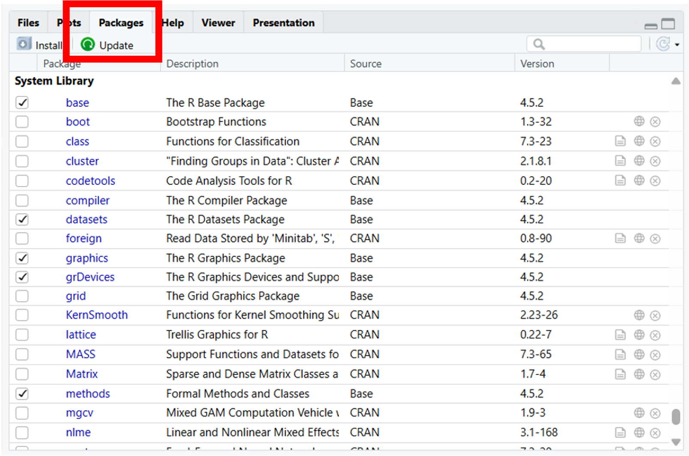

## Common data formats

Common tabular data formats include:

- Comma-separated values (CSV) `.csv` {.inline-logo height=1.2em}
- Excel spreadsheet `.xls`, `.xlsx` {.inline-logo height=1em}
- SAS data `.sas7bdat` {.inline-logo height=0.8em}
- R data `.rds` (for a single object), `.RData` (for multiple objects) {.inline-logo height=0.8em}

\* *Some of these, like Excel spreadsheets and R data, can store non-tabular data too.*

**Reading** data means to load it into R so you can work with it. For example, `read.csv()` converts a CSV file into a data frame. **Writing** data means to save it from R to your computer. For example, `write.csv()` converts a data frame into a CSV file.

::: {.callout-caution}
## **Caution**
Different data formats store missing data differently. In CSV, missingness is just blank. In Excel, missingness is an empty cell. In SAS, missingness is `.` (if numeric) or `""` (if categorical). In R, missingness is `NA`. Writing an R data frame that has missingness into Excel will make it appear as `"NA"`.
:::

## Common data tasks

Performing statistical tests is just one task that data scientists do. In fact, data scientists spend most of their time on **data wrangling** -- not tests! This includes:

- **Cleaning:** typos, missingness, duplicates, formatting
- **Other transformations:** merge datasets, create/remove variables, filter observations, standardization

Data scientists also need to explore and visualize the data:

- **Summary tables**
- **Plots**

## Updating R packages

Package maintainers may occasionally provide updates (e.g., bug fixes, upon major R releases). Updating your R version does not automatically update packages.

::: {.panel-tabset}

### RStudio

To update packages in RStudio, go to the **Packages** tab in the bottom right pane and click **Update**. Packages with updates available will be listed. Select those that you want to update and click **Install Updates**.

{width=600px}

### Command-line

Alternatively, if you want to use commands instead, then:

1. Go to the console (bottom left pane)
2. Run `old.packages()` - this lists packages with updates available. It does not update anything yet, but lets you see what is outdated. The `Installed` column tells you what version you currently have. The `ReposVer` column tells you what version is available.
    - Note that running `old.packages()` may list more outdated packages than RStudio's **Update** button because they use different rules.
    - You can also run `packageStatus()` to get a numerical count of outdated packages in your libraries.
3. Run `update.packages()` - this goes through each item on the list and asks you to confirm the update (Yes / No / Cancel). Cicking Cancel at any time will stop the process without updating anything.
    - If you want it to update everything silently, run `update.packages(ask = FALSE)`

*Note that simply running `install.packages()` for a package you already have installs a newer comptible version (if one is available). In that sense, it can also be used to update individual packages, although it is inconvenient for updating many packages. For example: `install.packages(c("dplyr", "magrittr"))`.*

:::

## R for ICES projects

In Ontario, Canada, administrative health data is stored at an institution called ICES. The main programming language used at ICES is SAS, though they have some support for other languages too -- including R. However, on their Research Analytic Environment (RAE) infrastructure, R is incredibly outdated. Thankfully, there is a pilot program (RAE Analytic Grid Pilot) where R is somewhat more updated and can be used for ICES projects if you apply for it. This is a good opportunity for students and analysts to practice their R rather than SAS.
