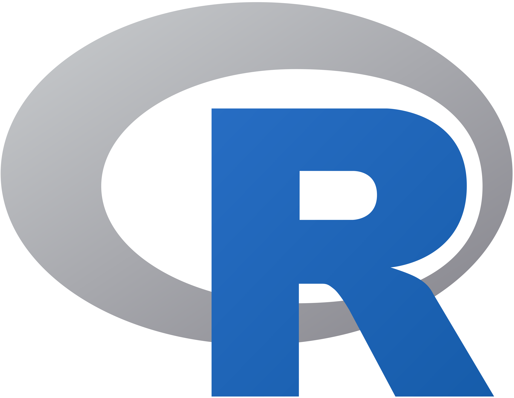

---
author:
  - name: Martin Ho
    email: martinkh.ho@mail.utoronto.ca
date: today
date-format: long
---

# Welcome {.landing-title}

## Software required

1. R {.inline-logo height=1em}
2. RStudio {.inline-logo height=1em}

## Motivation

In the world of regulatory drug submissions, SAS has been dominant. Regulatory agencies (e.g., U.S. FDA, Health Canada) allow other languages such as R too, but historical concerns about validity have held R back. Yet more and more, the U.S. FDA is opening the door to submissions in R, and other regulatory agencies may soon follow suit.

SAS and R represent different ends of a spectrum, each with pros and cons [@kenneth2023sas]:

| Language | Characteristics | Pros | Cons |
|--------|-----------|----------------|----------------|
| **SAS** | - Proprietary - Paid | - Reputation for regulatory compliance - Standardized procedures - Rigorously tested - Vendor handles updates, documentation, abd support | - Expensive - Rigid - Not as extensible |
| **R** | - Open source - Free | - Accessible - Flexible - Extensible - Rich community contributions | - Might not be as rigorously tested; dependencies may be at different stages of development - The burden to ensure regulatory compliance falls on companies |

What is changing is the R ecosystem. The [Pharmaverse](https://pharmaverse.org/) (conceived in 2020) brings together people from different pharmaceutical companies to collaboratively develop regulatory-compliant R packages [@eugenio2023pharmaverse]. Instead of the burden falling on each company to validate their code, often duplicating work in silos, they now work together to make standardized workflows.

- In 2021, Novo Nordisk completed a new drug application entirely in R [@appsilonteam2024why].
- Companies like GSK, Roche, and Johnson & Johnson have also been moving towards R-based drug submissions [@appsilonteam2024why].
- In 2025, after a series of successful pilots [@rconsortium2026submissions], the FDA expanded accepted R file formats, further supporting R workflows [@rconsortium2025expanded].

As pharmacoepidemiologists, we often work on *post-market* evaluations of drugs instead of new drug submissions (though the latter is gaining traction). However, pharmacoepidemiology has historically been shaped by similar motivations for validity, privacy, and security. Institutions like the U.S. Centers for Disease Control and Prevention (CDC) and Ontario ICES have long favoured SAS. With well-established infrastructure and reusable macros, it often feels like the path of least resistance for students and analysts to learn SAS whenever they want to use protected public health data.

As technology moves at an ever-increasing pace, SAS is falling behind. It lacks the flexibility and extensibility that R offers; scientists have to work within vendor-locked SAS workflows. And with increasing use of machine learning, Python (another open source language) is becoming popular as well. The shifting tides to open source is exacerbated by large language models (LLMs) like OpenAI's GPT and Anthropic's Claude, which have powerful coding capabilities [@favaro2026when], but they need to be trained on publicly available data. Because SAS is siloed, LLMs have less code and documentation to train on, resulting in less support [@pereira2026vs].

The shift will take time. Institutions will have to train and hire staff, build new infrastructure, and develop governance policies. There is no better time to learn R than during this transition period!

## Declaration of generative AI and AI-assisted technologies

All instructional material in this book was written by the author. Generative AI did not determine the content or technical recommendations presented here, though OpenAI ChatGPT (GPT-5.6-Sol, reasoning: instant) was used for proofreading. OpenAI Codex (GPT-5.6-Terra, reasoning: high) was used to help with formatting the material as a Quarto book. The author reviewed, edited, and verified the proofreading and code as needed and takes full responsibility for the final product.

## References
